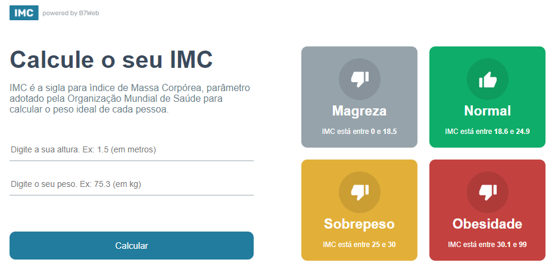

# Calculadora de IMC

Projeto em React + Typescript fazendo uma calculadora de IMC. 

Projeto desenvolvido durante o curso B7Web. 

### Instalação
- `npm install`

### Para rodar 
- `npm start`

[Clique aqui para acessar](https://brendondejesus.github.io/react-calc-imc/)

## Tecnologias

- HTML
- CSS
- Typescript 
- React
- Git e Github

## Contato

brendondejesus@hotmail.com